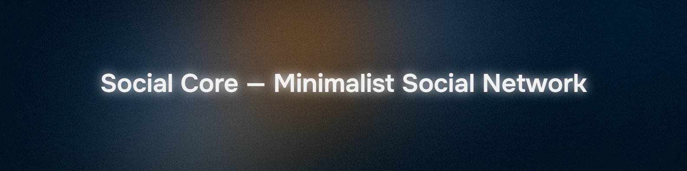
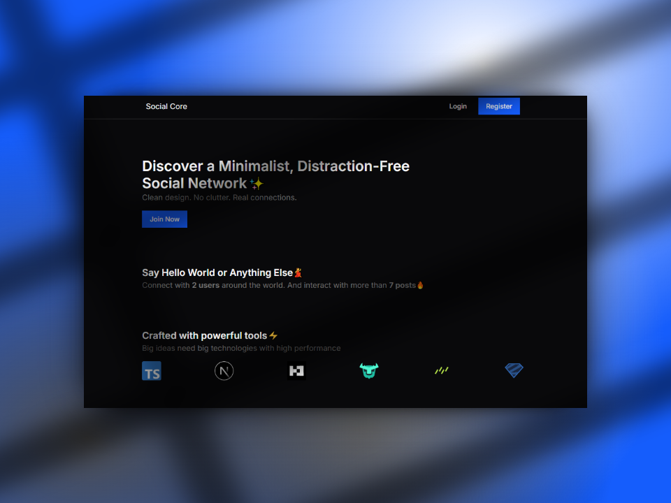

# Social Core — Minimalist Social Network

Welcome to **Social Core**, a minimalist social network focused on simplicity, clean interfaces, and meaningful connections.

## 🚀 Tech Stack

- **Runtime:** [Bun](https://bun.sh)
- **Framework:** [Next.js](https://nextjs.org)
- **Database:** [Turso](https://turso.tech)
- **Libraries:**
  - [Zod](https://zod.dev) — schema validation
  - [Better Auth](https://github.com/better-auth/better-auth) — authentication
  - [React Hook Form](https://react-hook-form.com) — form management
  - [Drizzle ORM](https://orm.drizzle.team) — type-safe ORM for SQL
  - [Tailwind CSS](https://tailwindcss.com) — utility-first CSS framework

## 📦 Features

- Clean, minimalist UI
- Simple and secure authentication
- Lightweight, performant backend powered by Bun
- Form handling with React Hook Form
- Type-safe database operations via Drizzle and Turso

## 📸 App

## 📄 License

This project is licensed under the [MIT License](./LICENSE).

---

**Social Core — Minimalist Social Network**
